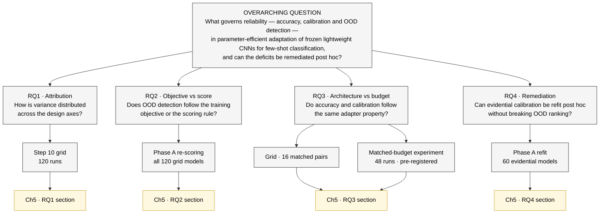
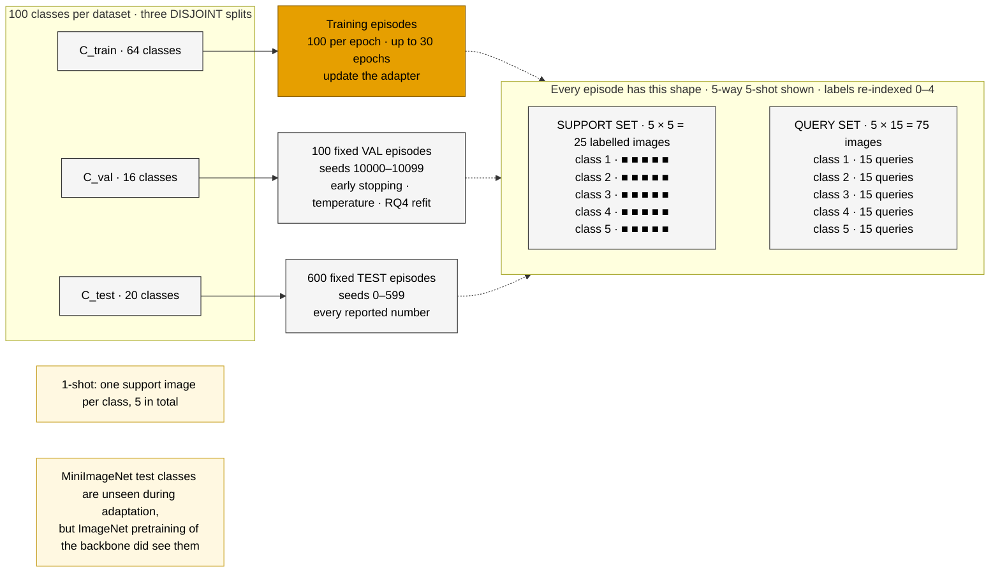
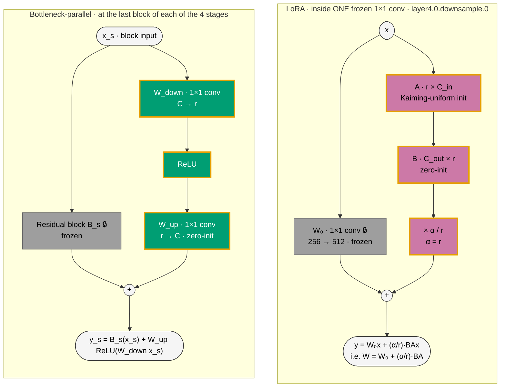
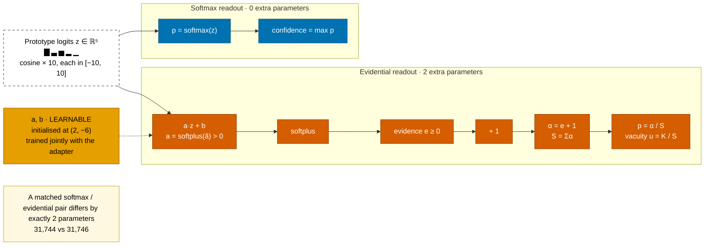
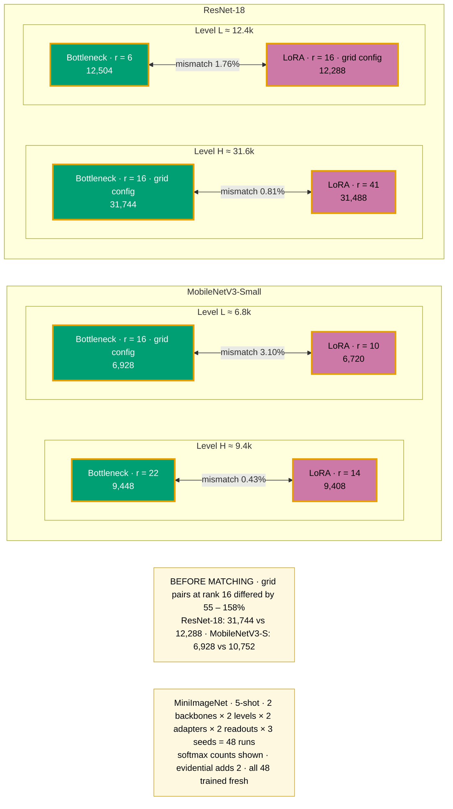
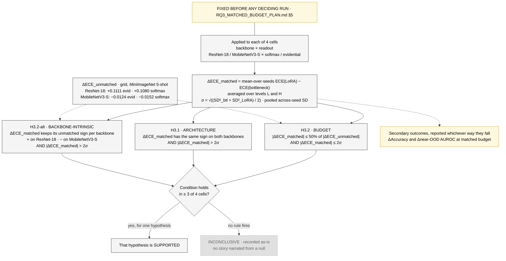
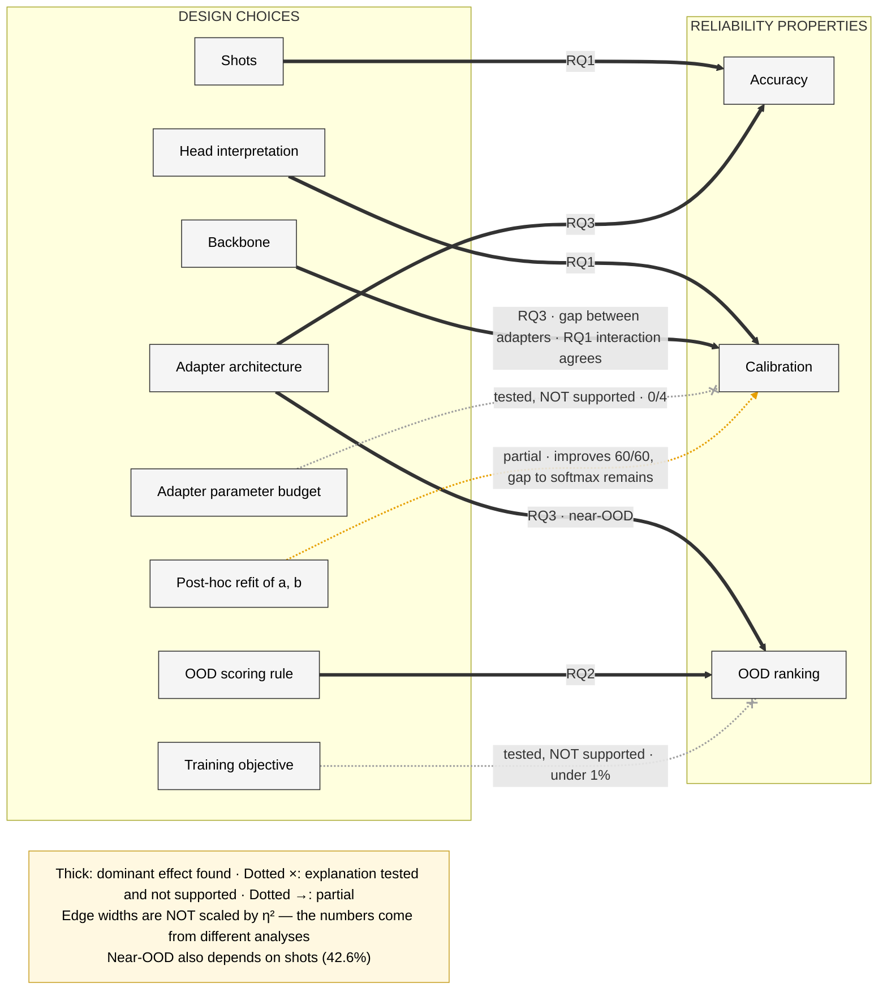

# Mermaid Source for the Drawn Diagrams — B-PEFT Thesis Report and Defence Slides

Companion to `report/DIAGRAM_PLAN.md`. The plan lists 16 figures: 8 drawn diagrams and 8 data plots. This
file holds **Mermaid code for the 8 drawn diagrams only**. The plots are left to the shared matplotlib script
(plan §1).

| ID | Diagram | Report | Slide | Mermaid covers |
|---|---|---|---|---|
| F1 | Research roadmap | Ch1 | 10 | all of it |
| F2 | Episodic few-shot protocol | Ch2 | 6 | all of it |
| F4 | System pipeline | Ch3 | 12 | all of it |
| F5 | The two adapters | Ch3 | 13 | panel (a); panel (b) is a bar plot |
| F6 | Two readouts of the same logits | Ch3 | 14 | panel (a); panel (b) is a curve plot |
| F7 | Experimental design | Ch3 | 15 | all of it |
| F8 | RQ3 matched-budget design and decision rule | Ch3 | 21B | panels (a) and (b) |
| F16 | Which design choice governs which property | Ch6, Ch7 | 2, 25 | all of it |

**Not in this file:** F3, F9, F10, F11, F12, F13, F14, F15, and the plot panels F5(b) and F6(b).

Every number below was checked against `docs/guide/` (01, 03, 04, 07, 09, 10),
`docs/RQ3_MATCHED_BUDGET_PLAN.md` §4–5 and `results/rq3_matched/verdict.json` on 2026-09-14.

**Updated 2026-09-15 from the RQ2/RQ4 completion run** (`notebooks/rq2_completion_rq1_interactions.ipynb`,
Kaggle run `notebook28109c47fb`, `results/rq_completion/REPORT.md`). The run retrained the 21 lost CIFAR-FS
5-shot checkpoints, and all 21 reproduce the grid exactly. Phase A now covers 120/120 models and RQ4 covers
60 evidential models. Changed: F1 (`E2`, `E4`), F7 (Phase A card, footer), F16 (refit edge,
backbone → calibration edge). The docs in `docs/guide/` still carry the 99-model numbers until they are
updated.

The wording rules in plan §1 apply: never "proves", "causes", "always", "first", "163×", or "calibration
follows the budget".

---

## 0. How to use this file

**Rendering.** Each block renders directly on GitHub and in VS Code's Markdown preview (with a Mermaid
extension). You can also paste a block into <https://mermaid.live>. All blocks were rendered without
errors with `@mermaid-js/mermaid-cli` 11.

**Exporting a vector file for `report/figures/`.** Save the code, without the fences, as `F4.mmd`, then:

```bash
npx -p @mermaid-js/mermaid-cli mmdc -i F4.mmd -o report/figures/F4_pipeline.pdf -b white --pdfFit
npx -p @mermaid-js/mermaid-cli mmdc -i F4.mmd -o report/figures/F4_pipeline.png -b white -s 3   # slides
```

**Finishing in draw.io.** The plan says to draw diagrams in draw.io or TikZ. To start from this code
instead of a blank page, use draw.io's *Arrange → Insert → Advanced → Mermaid*, then fix the layout and
fonts by hand. Mermaid places nodes automatically, so treat its layout as a first draft.

**What Mermaid cannot do, and the workaround used here:**

| Plan asks for | Here | Finish by hand? |
|---|---|---|
| Lock icon on frozen parts | 🔒 emoji in the label | Swap for a real icon in draw.io/TikZ |
| Typeset formulas | Unicode (α, Σ, ₀, ²) | Use LaTeX math in the thesis version |
| "Crossed-out" edge | Dotted edge with an × arrowhead | No |
| Exact positions | Automatic layout | Yes, for the final thesis figure |

### 0.1 Shared style

Mermaid diagrams do not share styles, so every block repeats these class definitions. The colours are the
plan's Okabe–Ito palette (§1). Every class sets both fill and text colour, so the nodes stay readable in
dark mode.

| Class | Meaning | Fill |
|---|---|---|
| `frozen` | Frozen, never updated | grey `#9E9E9E` |
| `trainable` | Trainable | orange `#E69F00` |
| `paramfree` | Parameter-free | white, dashed outline |
| `softmax` | Softmax readout | blue `#0072B2` |
| `ts` | Temperature-scaled softmax | sky blue `#56B4E9` |
| `evid` | Evidential readout | vermillion `#D55E00` |
| `btl` | Bottleneck adapter (orange border = trainable) | green `#009E73` |
| `lora` | LoRA adapter (orange border = trainable) | pink `#CC79A7` |
| `neutral` | Plain box | light grey `#F5F5F5` |
| `muted` | Greyed out / not counted | `#E0E0E0`, dashed |
| `note` | Annotation or caption-like text | pale yellow `#FFF8E1` |

```text
classDef frozen    fill:#9E9E9E,stroke:#616161,color:#000
classDef trainable fill:#E69F00,stroke:#8A5F00,color:#000
classDef paramfree fill:#FFFFFF,stroke:#333333,stroke-dasharray:5 5,color:#000
classDef softmax   fill:#0072B2,stroke:#004C77,color:#FFF
classDef ts        fill:#56B4E9,stroke:#2A7FB0,color:#000
classDef evid      fill:#D55E00,stroke:#8F3F00,color:#FFF
classDef btl       fill:#009E73,stroke:#E69F00,stroke-width:3px,color:#FFF
classDef lora      fill:#CC79A7,stroke:#E69F00,stroke-width:3px,color:#000
classDef neutral   fill:#F5F5F5,stroke:#333333,color:#000
classDef muted     fill:#E0E0E0,stroke:#9E9E9E,stroke-dasharray:3 3,color:#616161
classDef note      fill:#FFF8E1,stroke:#C9A227,color:#000
```

---

## F1 — Research roadmap (Ch1, Slide 10)

**Source.** `07_introduction.md` §7.6 (overarching question, RQ wording); experiment sizes from
`04_experiments.md` §4.1.



**Caption.** "Research questions, the experiments that answer them, and where each is reported."

**Notes.**

- Final RQ numbering only. The Orig-RQs are left out.
- Replace "Ch5 · RQn section" with real section numbers once Chapter 5 is laid out.
- `E2` no longer says "no training". Phase A itself trains nothing, but 21 of its 120 checkpoints had to be
  retrained first (see F7).

---

## F2 — Episodic few-shot protocol (Ch2, Slide 6)

**Source.** `01_what_we_built.md` §1.3–1.4; `09_methodology.md` §9.2, §9.5 (episode seeds).



**Caption.** "Episodic 5-way K-shot evaluation. Each episode samples 5 classes with 1 or 5 labelled support
images and 15 queries per class; test episodes use only classes never seen during adaptation."

**Notes.**

- Keep the `LEAK` note. The plan's watch-out: don't imply the *backbone* never saw MiniImageNet test
  classes.
- The training episodes use their own seed range (20000 + …) and are not frozen files. Only VAL and TEST
  are in `configs/*_episodes.yaml`.

---

## F4 — System pipeline (Ch3, Slide 12) — the main method figure

**Source.** `09_methodology.md` §9.1, §9.3 (backbones, adapter sites, prototype head, readouts), §9.7
(energy on raw logits).

**Fixes from plan §0 applied:** the adapter sits **inside** the backbone, and the frozen counts are the
parameters actually used (11,176,512 / 927,008), not the full-model sizes.

```mermaid
flowchart LR
    IS["Support images<br/>5 × N_S · N_S = 1 or 5"]:::neutral
    IQ["Query images · 75<br/>+ OOD images · 500 per pool"]:::neutral

    subgraph BB["🔒 FROZEN ImageNet-pretrained backbone · 11,176,512 (ResNet-18) / 927,008 (MobileNetV3-S) params, never updated"]
        direction LR
        subgraph ST1["Stage 1"]
            direction TB
            B1["blocks 🔒"]:::frozen
            A1["adapter"]:::trainable
        end
        subgraph ST2["Stage 2"]
            direction TB
            B2["blocks 🔒"]:::frozen
            A2["adapter"]:::trainable
        end
        subgraph ST3["Stage 3"]
            direction TB
            B3["blocks 🔒"]:::frozen
            A3["adapter"]:::trainable
        end
        subgraph ST4["Stage 4"]
            direction TB
            B4["blocks 🔒"]:::frozen
            A4["adapter"]:::trainable
        end
        ST1 --> ST2 --> ST3 --> ST4
    end

    TRN["TRAINABLE · 6,928 – 31,744 params (rank 16)<br/>Bottleneck: at the last block of every stage<br/>LoRA: inside one 1×1 conv of the last stage only"]:::trainable

    IS --> BB
    IQ --> BB
    BB -- "support" --> FS["Pooled support features<br/>512-d / 576-d"]:::neutral
    BB -- "query / OOD" --> FQ["Pooled query / OOD features<br/>512-d / 576-d"]:::neutral

    subgraph HEAD["PARAMETER-FREE prototype head · a class = mean of its support embeddings"]
        direction TB
        PROTO["c_k = mean support feature of class k"]:::paramfree
        LOGIT["z_k = 10 × cos( g(x), c_k )<br/>logits z ∈ ℝ⁵"]:::paramfree
        PROTO --> LOGIT
    end

    FS --> PROTO
    FQ --> LOGIT

    subgraph SMX["Softmax readout"]
        direction TB
        PS["p = softmax(z)"]:::softmax
        MSP["MSP = max p"]:::softmax
        TSM["TS-MSP = max softmax(z / T)<br/>T fitted on VAL"]:::ts
        PS --> MSP
        PS --> TSM
    end

    subgraph EVR["Evidential readout"]
        direction TB
        EV["e = softplus(a·z + b)"]:::evid
        AL["α = e + 1 · S = Σα"]:::evid
        PU["p = α / S · u = K / S"]:::evid
        VAC["vacuity score"]:::evid
        EV --> AL --> PU --> VAC
    end

    ENG["Energy = logsumexp(z)<br/>on raw z in BOTH readouts"]:::neutral
    AB["a, b · 2 learnable scalars"]:::trainable

    LOGIT --> PS
    LOGIT --> EV
    LOGIT --> ENG
    AB -.-> EV
    TRN -.- BB

    classDef frozen    fill:#9E9E9E,stroke:#616161,color:#000
    classDef trainable fill:#E69F00,stroke:#8A5F00,color:#000
    classDef paramfree fill:#FFFFFF,stroke:#333333,stroke-dasharray:5 5,color:#000
    classDef softmax   fill:#0072B2,stroke:#004C77,color:#FFF
    classDef ts        fill:#56B4E9,stroke:#2A7FB0,color:#000
    classDef evid      fill:#D55E00,stroke:#8F3F00,color:#FFF
    classDef neutral   fill:#F5F5F5,stroke:#333333,color:#000
```



**Caption.** "Framework overview. A frozen ImageNet-pretrained CNN with a small trainable adapter embeds
support and query images; a parameter-free prototype head produces cosine-similarity logits, read either as
a softmax or as Dirichlet evidence."

**Notes.**

- Cosine × 10, not L2 (`09_methodology.md` §9.3.3).
- The four adapter boxes show the **bottleneck** placement. For a LoRA figure, keep only the Stage 4 box.
  The `TRN` note says this.
- MobileNetV3-Small bottleneck sites are `features.3/6/8/11`; its first stage has no eligible site. "4
  stages" is exact for ResNet-18 and approximate for MobileNetV3-S; say so in the text.
- "6,928 – 31,744" is the adapter only. With the evidential scalars the range is 6,930 – 31,746 (the deck's
  Slide 12 quotes that one). Pick one and use it everywhere.

---

## F5(a) — The two adapters (Ch3, Slides 13 and 21A)

**Source.** `09_methodology.md` §9.3.2; `01_what_we_built.md` §1.2. Panel (b), the parameter-reversal bars,
is a plot and is not here.

ResNet-18 shown.



**Caption, panel (a) part.** "(a) The parallel bottleneck adds a zero-initialised side branch at every stage;
LoRA adds a zero-initialised low-rank update inside one frozen 1×1 convolution (rank 16)."

**Put in the text, not the diagram:** the MobileNetV3-Small sites. The bottleneck sits at `features.3/6/8/11`
(C = 24/40/48/96). LoRA sits at `features.11.block.3.0` (576 → 96).

**Parameter formulas**, for panel (b) and the text: bottleneck 1924r + 960 (ResNet-18) and 420r + 208
(MobileNetV3-S); LoRA 768r and 672r. At r = 16 these give 31,744 / 6,928 and 12,288 / 10,752.

**Watch out.**

- The reversal was **noticed, not designed**.
- Keep "coverage across depth explains accuracy" out of the caption; that is untested.
- Deck Slide 13 writes the LoRA update as `A·B`. The code and `09_methodology.md` use `BA` (B = C_out × r),
  which is what this diagram uses. Fix the slide.

---

## F6(a) — Two readouts of the same logits (Ch3, Slide 14)

**Source.** `09_methodology.md` §9.3.4. Panel (b), the evidence curves, is a plot and is not here.



**Caption, panel (a) part.** "Both readouts use the same prototype logits; the evidential readout maps them
to Dirichlet evidence through a learnable affine and softplus."

**Watch out.** (a, b) are **learnable**, not frozen at (2, −6). The `AB` node says so; don't shorten it to
"(2, −6)".

---

## F7 — Experimental design (Ch3, Slide 15) — the deck centrepiece

**Source.** `04_experiments.md` §4.1, §4.3, §4.5–4.7; `09_methodology.md` §9.9.1.

```mermaid
%%{init: {"flowchart": {"wrappingWidth": 420}}}%%
flowchart LR
    subgraph GRID["MAIN FACTORIAL GRID · Step 10"]
        direction TB
        subgraph AX["Five design axes · two levels each"]
            direction LR
            subgraph axD["Dataset"]
                direction TB
                d1["CIFAR-FS"]:::neutral
                d2["MiniImageNet"]:::neutral
            end
            subgraph axS["Shots"]
                direction TB
                s1["1-shot"]:::neutral
                s2["5-shot"]:::neutral
            end
            subgraph axB["Backbone"]
                direction TB
                bk1["ResNet-18"]:::neutral
                bk2["MobileNetV3-S"]:::neutral
            end
            subgraph axA["Adapter"]
                direction TB
                ad1["Bottleneck"]:::btl
                ad2["LoRA"]:::lora
            end
            subgraph axH["Head"]
                direction TB
                h1["softmax"]:::softmax
                h2["evidential"]:::evid
            end
            axD ~~~ axS ~~~ axB ~~~ axA ~~~ axH
        end
        CELLS["2⁵ = 32 balanced cells<br/>+ 8 baseline cells · Full FT, Linear Probe · ResNet-18 + CIFAR-FS<br/>= 40 cells × 3 seeds = 120 RUNS<br/>→ RQ1 · first evidence for RQ3"]:::neutral
        AX --> CELLS
    end

    subgraph FU["FOLLOW-UP EXPERIMENTS · each answers what the grid alone cannot"]
        direction TB
        subgraph PA["① Phase A re-scoring · no new configurations"]
            direction TB
            PA2["99 checkpoints recovered<br/>+ 21 lost CIFAR-FS 5-shot ones retrained from their grid configs<br/>21 / 21 reproduce the grid exactly"]:::neutral
            PA1["120 / 120 checkpoints re-scored<br/>all 4 scores × both readouts<br/>→ RQ2 and RQ4"]:::neutral
            PA2 --> PA1
        end
        MB["② Matched-budget · PRE-REGISTERED<br/>48 runs · MiniImageNet 5-shot<br/>→ RQ3"]:::neutral
        RS["③ Rank sweep<br/>21 runs · ranks 1 – 64<br/>→ former RQ5"]:::neutral
    end

    CELLS -- "saved checkpoints" --> PA
    CELLS -. "adapter axis confounded with backbone" .-> MB

    FOOT["189 training runs (120 + 48 + 21) · 600 frozen test episodes each · 0 run errors<br/>The 21 retrained grid checkpoints repeat grid runs exactly, so they are not counted again"]:::note

    classDef neutral fill:#F5F5F5,stroke:#333333,color:#000
    classDef btl     fill:#009E73,stroke:#E69F00,stroke-width:3px,color:#FFF
    classDef lora    fill:#CC79A7,stroke:#E69F00,stroke-width:3px,color:#000
    classDef softmax fill:#0072B2,stroke:#004C77,color:#FFF
    classDef evid    fill:#D55E00,stroke:#8F3F00,color:#FFF
    classDef note    fill:#FFF8E1,stroke:#C9A227,color:#000
```



**Caption.** "Evidence base: a balanced five-axis factorial for variance attribution, plus a checkpoint
re-scoring, a pre-registered matched-budget experiment and a controlled rank sweep, each answering a
question the grid alone cannot."

**Notes.**

- The rank sweep has no arrow from the grid on purpose. It is a separate CIFAR-FS × ResNet-18 ×
  bottleneck × evidential study, not a re-use of grid checkpoints.
- Footer counts: grid run log 0 errors (`04_experiments.md` §4.3), rank sweep 21/21 OK (§4.6),
  matched-budget 48/48 OK (§4.7), completion run 21/21 OK (`REPORT.md`).
- **The retrained 21 are not new runs.** Each one used its committed grid config and seed. All 21 regression
  guards were exact (max difference 0), and `best_val_epoch` matched the grid in 21/21. That is why the
  footer does not add them to the 189. Don't confuse them with the rank sweep's 21 runs, which are new
  configurations.
- The grey "21 checkpoints missing" box is gone. Coverage is complete.

---

## F8 — RQ3 matched-budget design and decision rule (Ch3, Slide 21B)

**Source.** `docs/RQ3_MATCHED_BUDGET_PLAN.md` §4 (design) and §5 (rule, thresholds verbatim);
`09_methodology.md` §9.9.4; `results/rq3_matched/verdict.json` → `decision.decision_rules`,
`decision.thresholds` (`collapse_ratio_max` 0.5, `sigma_multiple` 2.0, `sd_ddof` 1, `min_cells_to_fire` 3).

### F8(a) — budgets matched within each backbone



### F8(b) — the pre-registered decision rule



**Caption.** "Matched-budget experiment (MiniImageNet 5-shot, 48 runs): (a) budgets matched within each
backbone; (b) the pre-registered decision rule."

**Notes.**

- The diagram shows the **design only**. The outcome (backbone 3/4, budget 0/4, architecture 0/4) belongs in
  F14, Chapter 5.
- **The "inconclusive" branch has two wordings.** The pre-registration (§5) says "if no rule fires". The
  code's `verdict.json` → `decision_rules.inconclusive` says "No rule fired, **or more than one did**". The
  diagram uses the pre-registered wording. The difference did not matter: exactly one rule fired.
- **Mismatch percentages depend on the denominator.** The figures above (1.76 / 0.81 / 3.10 / 0.43%) divide
  by the smaller arm, as `09_methodology.md` and `04_experiments.md` do. The pre-registration table §4
  prints 3.00% and 0.42% for MobileNetV3-S, dividing by the larger arm. Use one convention and say which in
  the caption or a footnote.

---

## F16 — Which design choice governs which property (Ch6–7, Slides 2 and 25)

**Source.** `10_discussion_and_conclusion.md` §10.1; deck Slide 25.



**Caption.** "Summary of findings: different design choices govern different aspects of reliability. Solid
edges: dominant effects found. Crossed edges: explanations tested and not supported."

**Notes.**

- The edges carry RQ tags, not effect sizes. The only numbers are on the two rejected edges and the partial
  edge, as the plan specifies. Don't add η² values to the thick edges.
- `Backbone → Calibration` means the **calibration gap between the two adapters**, not calibration in
  general; the label says so. Which backbone property is responsible is unidentified; don't write "causes".
- `linkStyle` indices count edges in the order they are written. If you add or reorder an edge, renumber
  them.
- **Refit edge, 60/60.** From the completion run: ECE improved in all 60 evidential models (was 48/48 on the
  recovered subset). **"Gap to softmax remains" has only been checked on the original 48.** Before
  finalising, check the 12 new cells in `results/rq_completion/rq2_rq4_summary.json` → `rq4_rows`
  (`ece_after` against `ece_softmax_ref`). If any refit cell beats softmax, change the label.
- **"RQ1 interaction agrees"** on `Backbone → Calibration`. With two-way terms added, RQ1's `backbone × adapter`
  term explains 3.28% of ECE variance (95% seed bootstrap 2.52–4.15%), which is 43% of the residual left by
  main effects. On accuracy it explains 0.73%, and on both OOD outcomes it is near zero
  (`results/rq_completion/rq1_interactions.json`). It corroborates RQ3; it is not the primary evidence, so it
  is not a separate thick edge. No η² goes on the edge.
- `Training objective → OOD` stays "under 1%" at full coverage: 0.17% far and 0.63% near.
